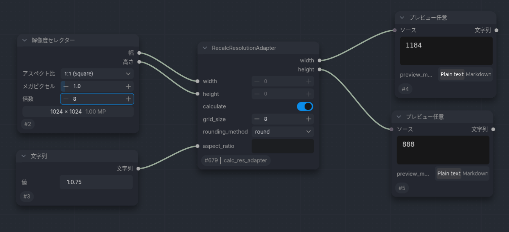

# itok_comfyui-trinkets-

## このリポジトリについて
[ComfyUI](https://github.com/Comfy-Org/ComfyUI)のワークフローと簡単なカスタムノードがあります。

## ワークフロー
QwenImage-2.1やMing-Imageのプロンプト拡張で出力されるJSON形式のプロンプトには，アスペクト比が含まれています。
そのアスペクト比の部分を取り出して，解像度を再計算し，出力するワークフローと，それをComfyUIのオフィシャルワークフローに追加したワークフローが置いてあります。
ダウンロードして，ComfyUIにドロップしてお使いください。
- QwenImage-2.1（ https://github.com/QwenLM/Qwen-Image-2.1 ）
	-  [parts_qwen_style.json](./workflows/Qwen-Image/parts_qwen_style.json)：アスペクト比の部分を取り出して，解像度を再計算し，出力するワークフローです
	- [image_qwen_image_2_1_t2i_add_calc_ar.json](./workflows/Qwen-Image/image_qwen_image_2_1_t2i_add_calc_ar_sg.json)：ComfyUIの標準ワークフローに当てはめたワークフローです。サブグラフは展開しています。
	- [image_qwen_image_2_1_t2i_add_calc_ar_sg.json](./workflows/Qwen-Image/image_qwen_image_2_1_t2i_add_calc_ar_sg.json)：サブグラフを展開せす，アスペクト比を取り出す部分をサブグラフの中に収めたワークフローです。
- Ming-Image（ https://github.com/inclusionAI/Ming-Image ）
	-  [parts_ming-image-style.json](./workflows/Ming-Image/ming_image_01_design_t2i_add_calc_ar_sg.json)：アスペクト比の部分を取り出して，解像度を再計算し，出力するワークフローです
	- [ming_image_01_design_t2i_add_calc_ar.json](./workflows/Ming-Image/ming_image_01_design_t2i_add_calc_ar_sg.json)：ComfyUIの標準ワークフローに当てはめたワークフローです。サブグラフは展開しています。
	- [ming_image_01_design_t2i_add_calc_ar_sg.json](./workflows/Ming-Image/ming_image_01_design_t2i_add_calc_ar_sg.json)：サブグラフを展開せす，アスペクト比を取り出す部分をサブグラフの中に収めたワークフローです。

## カスタムノード
### [calc_res_adapter.py](./custome_nodes/calc_res_adapter.py)
上記ワークフローのサブグラフ「Calc resolution」と同じ動作をします。単純計算のため，速度は変わりないです。
与えられたwidthとheightを文字列で与えられたアスペクト比（"16:9"など）に基づいて再計算し出力します。出力は，grid_sizeの整数倍になるように丸められます。
aspect_ratioがNoneまたは空の場合，calculateがFalseの場合は，widthとheightをそのまま出力します。
### 導入方法
ファイルをダウンロードして「custom_nodes」フォルダに入れて，ComfyUIを再起動してください。
「RecalcResolutionAdapter」ノードが使用できるようになります。
### 使用方法
[サンプルワークフロー](./workflows/examples/recalc_resolution_adapter_example.json )
